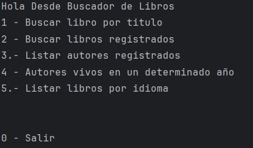
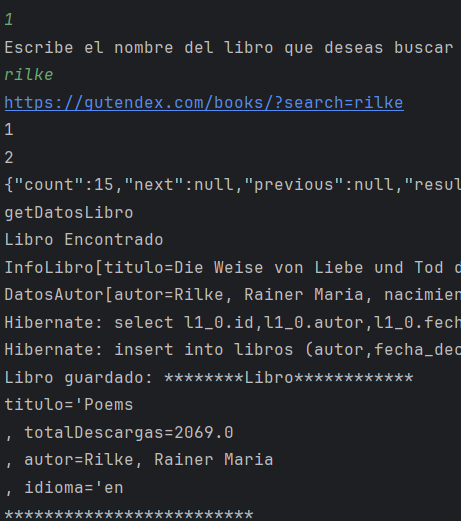
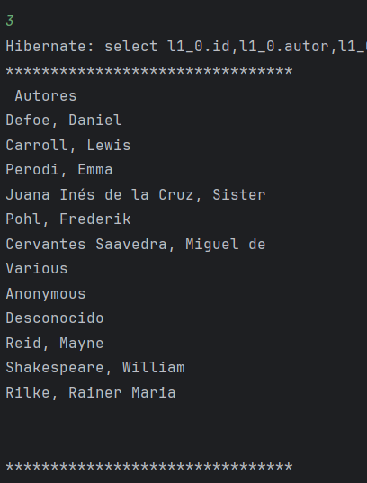
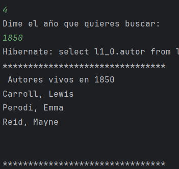
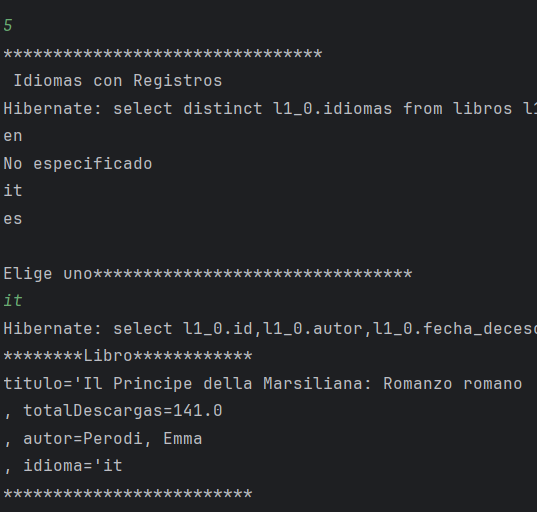

# BookChallenge
Segundo Challenge backend Alura ONE

Este proyecto cumple con cinco funciones principales, y con las funciones requeridas de persistencia de datos consumiendo una API y conectando con una base de datos en PostgreSQL.

# Requerimientos

1.- GSON: Como herramienta para procesar las respuestas en formato Json al realizar las consultas
2.- Para nuestro actual desafío, hemos elegido la API "Gutendex" que proporciona acceso a la base de datos de libros del proyecto gutenberg.
3.- PostgreSQL
# Uso
Este proyecto está desarrollado con Spring, maven, java 17, 

Al momento de ejecutarlo se ejecuta un menú con opciones, el  usuario puede accederlas, crear nuevos registros y ejecutar consultas. 

# Funcionamiento

